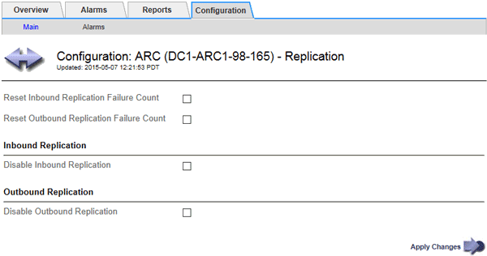

= Configurar a replicação do nó de arquivo
:allow-uri-read: 
:icons: font
:imagesdir: ../media/

[role="lead"]
Você pode configurar as configurações de replicação para um nó de arquivo e desativar a replicação de entrada e saída ou redefinir as contagens de falha que estão sendo rastreadas para os alarmes associados.

.Antes de começar
* Você está conetado ao Gerenciador de Grade usando um link:../admin/web-browser-requirements.html["navegador da web suportado"].
* Você link:admin-group-permissions.html["permissões de acesso específicas"]tem .

.Passos
. Selecione *SUPPORT* > *Tools* > *Grid topology*.
. Selecione *_Archive Node_* > *ARC* > *Replication*.
. Selecione *Configuração* > *Principal*.
+

. Modifique as seguintes definições, conforme necessário:
+
** *Redefinir contagem de falhas de replicação de entrada*: Selecione para redefinir o contador para falhas de replicação de entrada. Isso pode ser usado para limpar o alarme RIRF (replicações embutidas -- Failed).
** *Redefinir contagem de falhas de replicação de saída*: Selecione para redefinir o contador para falhas de replicação de saída. Isso pode ser usado para limpar o alarme RORF (Outbound replicações -- Failed).
** *Desativar replicação de entrada*: Selecione para desativar a replicação de entrada como parte de um procedimento de manutenção ou teste. Deixe limpo durante o funcionamento normal.
+
Quando a replicação de entrada é desativada, os dados de objeto podem ser recuperados do serviço ARC para replicação para outros locais no sistema StorageGRID, mas os objetos não podem ser replicados para este serviço ARC a partir de outros locais do sistema. O serviço ARC é apenas de leitura.

** *Desativar replicação de saída*: Marque a caixa de seleção para desativar a replicação de saída (incluindo solicitações de conteúdo para recuperações HTTP) como parte de um procedimento de manutenção ou teste. Deixe desmarcado durante o funcionamento normal.
+
Quando a replicação de saída é desativada, os dados de objeto podem ser copiados para este serviço ARC para satisfazer as regras ILM, mas os dados de objeto não podem ser recuperados do serviço ARC para serem copiados para outros locais no sistema StorageGRID. O serviço ARC é apenas de escrita.

. Selecione *aplicar alterações*.

