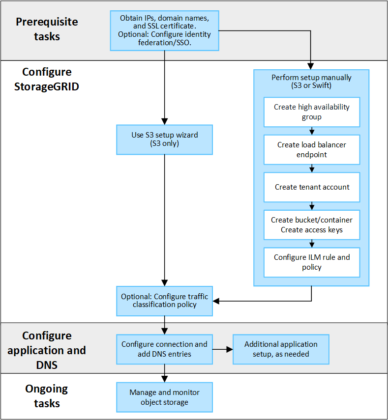

= Configurar conexões de cliente S3 e Swift: Visão geral
:allow-uri-read: 
:icons: font
:imagesdir: ../media/

[role="lead"]
Como administrador de grade, você gerencia as opções de configuração que controlam como os aplicativos cliente S3 e Swift se conetam ao seu sistema StorageGRID para armazenar e recuperar dados.

NOTE: O suporte para aplicativos cliente Swift foi obsoleto e será removido em uma versão futura.

== Fluxo de trabalho de configuração

Como mostrado no diagrama de fluxo de trabalho, existem quatro etapas principais para conetar o StorageGRID a qualquer aplicativo S3 ou Swift:

. Execute tarefas de pré-requisito no StorageGRID, com base na forma como o aplicativo cliente se conetará ao StorageGRID.
. Use StorageGRID para obter os valores que o aplicativo precisa para se conetar à grade. Você pode usar o assistente de configuração do S3 ou configurar cada entidade do StorageGRID manualmente.
. Use o aplicativo S3 ou Swift para concluir a conexão com o StorageGRID. Crie entradas DNS para associar endereços IP a qualquer nome de domínio que você pretende usar.
. Executar tarefas contínuas na aplicação e no StorageGRID para gerenciar e monitorar o storage de objetos ao longo do tempo.

== Informações necessárias para anexar o StorageGRID a um aplicativo cliente

Antes de poder anexar o StorageGRID a um aplicativo cliente S3 ou Swift, você deve executar as etapas de configuração no StorageGRID e obter determinado valor.

=== Quais valores eu preciso?

A tabela a seguir mostra os valores que você deve configurar no StorageGRID e onde esses valores são usados pelo aplicativo S3 ou Swift e pelo servidor DNS.

[cols="1a,1a,1a"]
|===
| Valor | Onde o valor está configurado | Onde o valor é usado 

 a| 
Endereços IP virtuais (VIP)
 a| 
StorageGRID > grupo HA
 a| 
Entrada DNS

 a| 
Porta
 a| 
StorageGRID > ponto final do balanceador de carga
 a| 
Aplicação cliente

 a| 
Certificado SSL
 a| 
StorageGRID > ponto final do balanceador de carga
 a| 
Aplicação cliente

 a| 
Nome do servidor (FQDN)
 a| 
StorageGRID > ponto final do balanceador de carga
 a| 
* Aplicação cliente
* Entrada DNS

 a| 
S3 ID da chave de acesso e chave de acesso secreta
 a| 
StorageGRID > locatário e balde
 a| 
Aplicação cliente

 a| 
Nome do balde/recipiente
 a| 
StorageGRID > locatário e balde
 a| 
Aplicação cliente

|===

=== Como obtenho esses valores?

Dependendo de seus requisitos, você pode fazer um dos seguintes procedimentos para obter as informações de que precisa:

* *Use o link:use-s3-setup-wizard.html["Assistente de configuração S3"]*. O assistente de configuração do S3 ajuda a configurar rapidamente os valores necessários no StorageGRID e gera um ou dois arquivos que você pode usar ao configurar o aplicativo S3. O assistente orienta você pelas etapas necessárias e ajuda a garantir que suas configurações estejam em conformidade com as práticas recomendadas do StorageGRID.
+

NOTE: Se você estiver configurando um aplicativo S3, é recomendável usar o assistente de configuração S3, a menos que você saiba que tem requisitos especiais ou que sua implementação exigirá uma personalização significativa.

* *Use o link:../fabricpool/use-fabricpool-setup-wizard.html["Assistente de configuração do FabricPool"]*. Semelhante ao assistente de configuração do S3, o assistente de configuração do FabricPool ajuda você a configurar rapidamente os valores necessários e gera um arquivo que você pode usar ao configurar um nível de nuvem do FabricPool no ONTAP.
+

NOTE: Se você planeja usar o StorageGRID como o sistema de storage de objetos em uma categoria de nuvem do FabricPool, é recomendável usar o assistente de configuração do FabricPool, a menos que você saiba que tem requisitos especiais ou que sua implementação exigirá personalização significativa.

* *Configurar itens manualmente*. Se você estiver se conetando a um aplicativo Swift (ou estiver se conetando a um aplicativo S3 e preferir não usar o assistente de configuração S3), você poderá obter os valores necessários executando a configuração manualmente. Siga estes passos:
+
.. Configure o grupo de alta disponibilidade (HA) que você deseja usar para o aplicativo S3 ou Swift. link:configure-high-availability-group.html["Configurar grupos de alta disponibilidade"]Consulte .
.. Crie o ponto de extremidade do balanceador de carga que o aplicativo S3 ou Swift usará. link:configuring-load-balancer-endpoints.html["Configurar pontos de extremidade do balanceador de carga"]Consulte .
.. Crie a conta de locatário que o aplicativo S3 ou Swift usará. link:creating-tenant-account.html["Crie uma conta de locatário"]Consulte .
.. Para um locatário do S3, faça login na conta do locatário e gere uma ID de chave de acesso e chave de acesso secreta para cada usuário que acessará o aplicativo. link:../tenant/creating-your-own-s3-access-keys.html["Crie suas próprias chaves de acesso"]Consulte .
.. Crie um ou mais buckets do S3 ou contentores Swift na conta do locatário. Para S3, link:../tenant/creating-s3-bucket.html["Crie um balde S3D."]consulte . Para Swift, use o link:../swift/container-operations.html["COLOQUE o pedido do recipiente"].
.. Para adicionar instruções de posicionamento específicas para os objetos pertencentes ao novo locatário ou bucket/container, crie uma nova regra ILM e ative uma nova política ILM para usar essa regra. link:../ilm/access-create-ilm-rule-wizard.html["Criar regra ILM"]Consulte e link:../ilm/creating-ilm-policy.html["Criar política ILM"].

