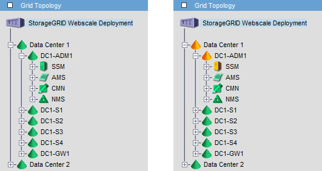

= Como os nós de administração mostram alarmes reconhecidos (sistema legado)
:allow-uri-read: 
:icons: font
:imagesdir: ../media/

[role="lead"]
Quando você reconhece um alarme em um nó Admin, o alarme reconhecido não é copiado para nenhum outro nó Admin. Como os reconhecimentos não são copiados para outros nós de administração, a árvore de topologia de grade pode não ter a mesma aparência para cada nó de administração.

Essa diferença pode ser útil ao conetar clientes da Web. Os clientes da Web podem ter visualizações diferentes do sistema StorageGRID com base nas necessidades do administrador.

Observe que as notificações são enviadas do nó Admin onde a confirmação ocorre.
