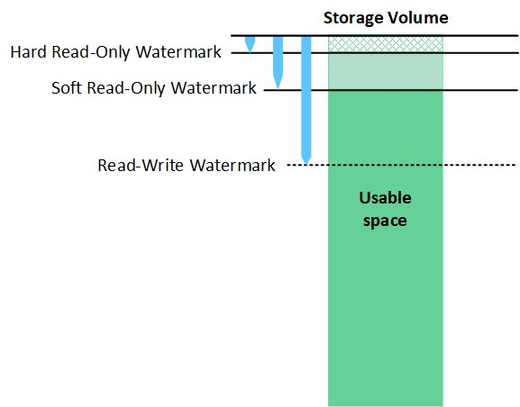

= O que são marcas d'água de volume de armazenamento?
:allow-uri-read: 
:icons: font
:imagesdir: ../media/

[role="lead"]
O StorageGRID usa três marcas d'água de volume de storage para garantir que os nós de storage sejam transferidos com segurança para um estado somente leitura antes que eles sejam executados com muito pouco espaço e para permitir que os nós de storage que foram transferidos para um estado somente leitura sejam novamente lidos.

NOTE: As marcas d'água do volume de armazenamento aplicam-se apenas ao espaço utilizado para dados de objetos replicados e codificados por apagamento. Para saber mais sobre o espaço reservado para metadados de objetos no volume 0, vá para link:managing-object-metadata-storage.html["Gerenciar o storage de metadados de objetos"].

== O que é o Soft Read-Only Watermark?

O *Storage volume Soft Read-Only Watermark* é a primeira marca d'água a indicar que o espaço utilizável de um nó de armazenamento para dados de objetos está se tornando cheio.

Se cada volume em um nó de armazenamento tiver menos espaço livre do que o Watermark Soft Read-Only desse volume, o nó de armazenamento muda para _read-only mode_. O modo somente leitura significa que o nó de storage anuncia serviços somente leitura para o resto do sistema StorageGRID, mas atende a todas as solicitações de gravação pendentes.

Por exemplo, suponha que cada volume em um nó de armazenamento tenha uma marca de água somente leitura suave de 10 GB. Assim que cada volume tiver menos de 10 GB de espaço livre, o nó de armazenamento passa para o modo somente leitura suave.

== O que é a marca d'água Hard Read-Only?

O *Storage volume Hard Read-Only Watermark* é a próxima marca d'água para indicar que o espaço utilizável de um nó para dados de objeto está se tornando cheio.

Se o espaço livre em um volume for menor do que a marca de água Hard Read-Only desse volume, as gravações no volume falharão. As gravações em outros volumes podem continuar, no entanto, até que o espaço livre nesses volumes seja menor do que suas marcas de água somente leitura dura.

Por exemplo, suponha que cada volume em um nó de armazenamento tenha uma marca d'água somente leitura de 5 GB. Assim que cada volume tiver menos de 5 GB de espaço livre, o nó de armazenamento não aceita mais nenhuma solicitação de gravação.

A marca d'água Hard Read-Only é sempre inferior à marca d'água Soft Read-Only.

== O que é a marca d'água Read-Write?

O *marca d'água de leitura e gravação de volume de armazenamento* aplica-se apenas a nós de armazenamento que tenham feito a transição para o modo somente leitura. Ele determina quando o nó pode se tornar leitura-gravação novamente. Quando o espaço livre em qualquer volume de armazenamento em um nó de armazenamento é maior do que a marca de água de leitura e gravação desse volume, o nó automaticamente faz a transição de volta para o estado de leitura e gravação.

Por exemplo, suponha que o nó de armazenamento tenha sido transferido para o modo somente leitura. Suponha também que cada volume tenha uma marca d'água de leitura-escrita de 30 GB. Assim que o espaço livre para qualquer volume aumentar para 30 GB, o nó torna-se leitura-gravação novamente.

A marca d'água de leitura-escrita é sempre maior do que a marca d'água Soft Read-Only e a marca d'água Hard Read-Only.

== Ver marcas de água do volume de armazenamento

Você pode visualizar as configurações atuais da marca d'água e os valores otimizados pelo sistema. Se não estiverem a ser utilizadas marcas de água otimizadas, pode determinar se pode ou deve ajustar as definições.

.Antes de começar
* Concluiu a atualização para o StorageGRID 11,6 ou superior.
* Você está conetado ao Gerenciador de Grade usando um link:../admin/web-browser-requirements.html["navegador da web suportado"].
* Você tem o link:admin-group-permissions.html["Permissão de acesso à raiz"].

=== Ver as definições atuais da marca d'água

Você pode exibir as configurações atuais de marca d'água de armazenamento no Gerenciador de Grade.

.Passos
. Selecione *SUPPORT* > *Other* > *Storage watermarks*.
. Na página marcas d'água de armazenamento, observe a caixa de seleção usar valores otimizados.
+
** Se a caixa de verificação estiver selecionada, todas as três marcas de água são otimizadas para cada volume de armazenamento em cada nó de armazenamento, com base no tamanho do nó de armazenamento e na capacidade relativa do volume.
+
Esta é a configuração padrão e recomendada. Não atualize estes valores. Opcionalmente, você pode <<view-optimized-storage-watermarks,Ver marcas de água de armazenamento otimizadas>>.

** Se a caixa de seleção usar valores otimizados não estiver selecionada, marcas de água personalizadas (não otimizadas) estão sendo usadas. Não é recomendável usar configurações personalizadas de marca d'água. Use as instruções para link:../troubleshoot/troubleshoot-low-watermark-alert.html["Solução de problemas de baixa substituição de marca d'água somente leitura alertas"]determinar se você pode ou deve ajustar as configurações.
+
Quando especificar definições de marca d'água personalizadas, tem de introduzir valores superiores a 0.

=== [[view-optimized-storage-watermarks]]Ver marcas de água de armazenamento otimizadas

O StorageGRID usa duas métricas Prometheus para mostrar os valores otimizados que calculou para a marca d'água *volume de armazenamento Soft Read-Only*. Você pode visualizar os valores otimizados mínimo e máximo para cada nó de storage em sua grade.

. Selecione *SUPPORT* > *Tools* > *Metrics*.
. Na seção Prometheus, selecione o link para acessar a interface do usuário Prometheus.
. Para ver a marca d'água mínima de leitura suave recomendada, insira a seguinte métrica Prometheus e selecione *execute*:
+
`storagegrid_storage_volume_minimum_optimized_soft_readonly_watermark`

+
A última coluna mostra o valor mínimo otimizado do Soft Read-Only Watermark para todos os volumes de armazenamento em cada nó de armazenamento. Se esse valor for maior que a configuração personalizada para o *Storage volume Soft Read-Only Watermark*, o alerta *Low read-only Watermark* (Sobreposição de marca d'água somente leitura baixa) será acionado para o Storage Node.

. Para ver a marca d'água somente leitura suave recomendada, insira a seguinte métrica Prometheus e selecione *execute*:
+
`storagegrid_storage_volume_maximum_optimized_soft_readonly_watermark`

+
A última coluna mostra o valor máximo otimizado do Soft Read-Only Watermark para todos os volumes de armazenamento em cada nó de armazenamento.

