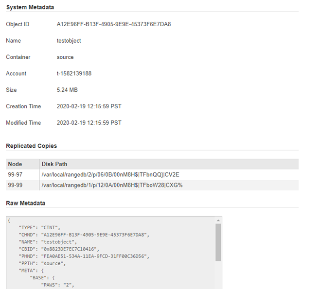

= Verifique uma política ILM com pesquisa de metadados de objeto
:allow-uri-read: 
:icons: font
:imagesdir: ../media/

[role="lead"]
Depois de ativar uma política ILM, você deve ingerir objetos de teste representativos no sistema StorageGRID. Em seguida, você deve fazer uma pesquisa de metadados de objeto para confirmar que as cópias estão sendo feitas conforme o pretendido e colocadas nos locais corretos.

.Antes de começar
* Você tem um identificador de objeto, que pode ser um dos seguintes:
+
** *UUID*: O Identificador universalmente exclusivo do objeto. Introduza o UUID em todas as maiúsculas.
** *CBID*: O identificador exclusivo do objeto dentro do StorageGRID. Você pode obter o CBID de um objeto a partir do log de auditoria. Introduza o CBID em todas as maiúsculas.
** *S3 bucket e chave de objeto*: Quando um objeto é ingerido através da interface S3, o aplicativo cliente usa uma combinação de bucket e chave de objeto para armazenar e identificar o objeto. Se o bucket S3 estiver versionado e você quiser procurar uma versão específica de um objeto S3 usando o bucket e a chave do objeto, você tem o *version ID*.
** * Nome do contentor e objeto Swift*: Quando um objeto é ingerido através da interface Swift, o aplicativo cliente usa uma combinação de nome de contentor e objeto para armazenar e identificar o objeto.

.Passos
. Ingira o objeto.
. Selecione *ILM* > *Object metadata lookup*.
. Digite o identificador do objeto no campo *Identificador*. Você pode inserir um UUID, CBID, S3 bucket/object-key ou Swift container/object-name.
. Opcionalmente, insira um ID de versão para o objeto (apenas S3).
. Selecione *Procurar*.
+
Os resultados da pesquisa de metadados de objeto aparecem. Esta página lista os seguintes tipos de informações:

+
** Metadados do sistema, incluindo:
+
*** Código Objeto (UUID)
*** nome do objeto
*** nome do recipiente
*** Tipo de resultado (objeto, marcador de exclusão, bucket S3 ou contentor Swift)
*** Nome ou ID da conta do locatário
*** tamanho lógico do objeto
*** data e hora em que o objeto foi criado pela primeira vez
*** data e hora em que o objeto foi modificado pela última vez

** Quaisquer pares de valor-chave de metadados de usuário personalizados associados ao objeto.
** Para objetos S3D, qualquer par de chave-valor de marca de objeto associado ao objeto.
** Para cópias de objetos replicadas, o local de storage atual de cada cópia.
** Para cópias de objetos com codificação de apagamento, o local de storage atual de cada fragmento.
** Para cópias de objetos em um Cloud Storage Pool, o local do objeto, incluindo o nome do bucket externo e o identificador exclusivo do objeto.
** Para objetos segmentados e objetos de várias partes, uma lista de segmentos, incluindo identificadores de segmento e tamanhos de dados. Para objetos com mais de 100 segmentos, apenas os primeiros 100 segmentos são mostrados.
** Todos os metadados de objetos no formato de armazenamento interno não processado. Esses metadados brutos incluem metadados internos do sistema que não são garantidos para persistir de liberação para liberação.

+
O exemplo a seguir mostra os resultados da pesquisa de metadados de objeto para um objeto de teste S3 que é armazenado como duas cópias replicadas.

+

NOTE: A captura de tela a seguir é um exemplo. Seus resultados variam de acordo com a versão do StorageGRID.

+

. Confirme se o objeto está armazenado no local ou locais corretos e se é o tipo correto de cópia.
+

NOTE: Se a opção Auditoria estiver ativada, você também poderá monitorar o log de auditoria para a mensagem regras de objeto ORLM atendidas. A mensagem de auditoria ORLM pode fornecer mais informações sobre o status do processo de avaliação ILM, mas não pode fornecer informações sobre a correção do posicionamento dos dados do objeto ou a integridade da política ILM. Você deve avaliar isso sozinho. Para obter detalhes, link:../audit/index.html["Rever registos de auditoria"]consulte .

.Informações relacionadas
* link:../s3/index.html["USE A API REST DO S3"]
* link:../swift/index.html["Use a API Swift REST"]

