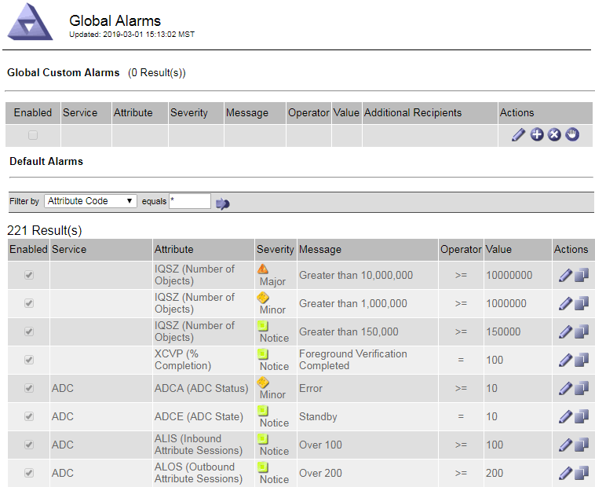

= Gerenciar alarmes (sistema legado)
:allow-uri-read: 
:icons: font
:imagesdir: ../media/

[role="lead"]
O sistema de alarme StorageGRID é o sistema legado usado para identificar pontos de problemas que às vezes ocorrem durante a operação normal.

NOTE: Embora o sistema de alarme antigo continue a ser suportado, o sistema de alerta oferece benefícios significativos e é mais fácil de usar.

== Classes de alarme (sistema legado)

Um alarme legado pode pertencer a uma das duas classes de alarme mutuamente exclusivas.

* Os alarmes padrão são fornecidos com cada sistema StorageGRID e não podem ser modificados. No entanto, você pode desativar os alarmes padrão ou substituí-los definindo alarmes personalizados globais.
* Os alarmes personalizados globais monitoram o status de todos os serviços de um determinado tipo no sistema StorageGRID. Você pode criar um alarme personalizado global para substituir um alarme padrão. Você também pode criar um novo alarme Global Custom. Isso pode ser útil para monitorar quaisquer condições personalizadas do seu sistema StorageGRID.

== Lógica de acionamento de alarme (sistema legado)

Um alarme legado é acionado quando um atributo StorageGRID atinge um valor limite que é avaliado como verdadeiro em relação a uma combinação de classe de alarme (padrão ou Personalizado Global) e nível de gravidade de alarme.

[cols="1a,1a,1a,3a"]
|===
| Ícone | Cor | Gravidade do alarme | Significado 

 a| 
image:../media/icon_alarm_yellow_notice.gif["ícone quadrado amarelo"]
 a| 
Amarelo
 a| 
Aviso
 a| 
O nó está conetado à grade, mas existe uma condição incomum que não afeta as operações normais.

 a| 
image:../media/icon_alert_yellow_minor.png["ícone de diamante laranja claro"]
 a| 
Laranja claro
 a| 
Menor
 a| 
O nó está conetado à grade, mas existe uma condição anormal que pode afetar a operação no futuro. Você deve investigar para evitar o escalonamento.

 a| 
image:../media/icon_alert_orange_major.png["ícone de diamante laranja escuro"]
 a| 
Laranja escuro
 a| 
Maior
 a| 
O nó está conetado à grade, mas existe uma condição anormal que afeta atualmente a operação. Isso requer atenção imediata para evitar o escalonamento.

 a| 
image:../media/icon_alert_red_critical.png["ícone vermelho x"]
 a| 
Vermelho
 a| 
Crítico
 a| 
O nó está conetado à grade, mas existe uma condição anormal que parou as operações normais. Você deve resolver o problema imediatamente.

|===
A gravidade do alarme e o valor limite correspondente podem ser definidos para cada atributo numérico. O serviço NMS em cada nó Admin monitora continuamente os valores de atributo atuais em relação aos limites configurados. Quando um alarme é acionado, uma notificação é enviada a todos os funcionários designados.

Observe que um nível de gravidade normal não aciona um alarme.

Os valores de atributo são avaliados em relação à lista de alarmes ativados definidos para esse atributo. A lista de alarmes é verificada na seguinte ordem para encontrar a primeira classe de alarme com um alarme definido e ativado para o atributo:

. Alarmes personalizados globais com severidades de alarme de crítico para Aviso.
. Alarmes padrão com severidades de alarme de crítico para baixo para Aviso.

Depois que um alarme ativado para um atributo é encontrado na classe de alarme mais alta, o serviço NMS só é avaliado dentro dessa classe. O serviço NMS não será avaliado em relação às outras classes de menor prioridade. Ou seja, se houver um alarme personalizado global habilitado para um atributo, o serviço NMS somente avaliará o valor do atributo em relação aos alarmes personalizados globais. Os alarmes predefinidos não são avaliados. Assim, um alarme padrão habilitado para um atributo pode atender aos critérios necessários para acionar um alarme, mas ele não será acionado porque um alarme personalizado global (que não atende aos critérios especificados) para o mesmo atributo está ativado. Nenhum alarme é acionado e nenhuma notificação é enviada.

=== Exemplo de acionamento de alarmes

Você pode usar este exemplo para entender como os alarmes personalizados globais e os alarmes padrão são acionados.

Para o exemplo a seguir, um atributo tem um alarme personalizado global e um alarme padrão definido e ativado como mostrado na tabela a seguir.

[cols="1a,2a,2a"]
|===
|  | Limiar de alarme personalizado global (ativado) | Limiar de alarme predefinido (ativado) 

 a| 
Aviso
 a| 
> 1500
 a| 
> 1000

 a| 
Menor
 a| 
> 15.000
 a| 
> 1000

 a| 
Maior
 a| 
> 150.000
 a| 
> 250.000

|===
Se o atributo for avaliado quando seu valor for 1000, nenhum alarme será acionado e nenhuma notificação será enviada.

O alarme personalizado global tem precedência sobre o alarme predefinido. Um valor de 1000 não atinge o valor limite de qualquer nível de gravidade para o alarme Personalizado Global. Como resultado, o nível de alarme é avaliado como normal.

Após o cenário acima, se o alarme Global Custom estiver desativado, nada muda. O valor do atributo deve ser reavaliado antes de um novo nível de alarme ser acionado.

Com o alarme Global Custom desativado, quando o valor do atributo é reavaliado, o valor do atributo é avaliado em relação aos valores de limite para o alarme padrão. O nível de alarme aciona um alarme de nível de aviso e uma notificação por e-mail é enviada ao pessoal designado.

=== Alarmes da mesma gravidade

Se dois alarmes personalizados globais para o mesmo atributo tiverem a mesma gravidade, os alarmes serão avaliados com uma prioridade "de cima para baixo".

Por exemplo, se UMEM cair para 50MB, o primeiro alarme é acionado (50000000), mas não o abaixo dele (100000000).

image::../media/alarm_order.gif[Exemplo de alarme personalizado global]

Se a ordem é invertida, quando UMEM cai para 100MB, o primeiro alarme (100000000) é acionado, mas não o abaixo dele (50000000).

image::../media/alarm_order_reversed.gif[Exemplo de alarme personalizado global]

=== Notificações

Uma notificação relata a ocorrência de um alarme ou a mudança de estado de um serviço. As notificações de alarme podem ser enviadas por e-mail ou usando SNMP.

Para evitar que vários alarmes e notificações sejam enviados quando um valor limite de alarme é atingido, a gravidade do alarme é verificada em relação à gravidade atual do alarme para o atributo. Se não houver nenhuma mudança, então nenhuma outra ação é tomada. Isso significa que, à medida que o serviço NMS continua a monitorar o sistema, ele só irá disparar um alarme e enviar notificações na primeira vez que detetar uma condição de alarme para um atributo. Se um novo limite de valor para o atributo for atingido e detetado, a gravidade do alarme será alterada e uma nova notificação será enviada. Os alarmes são apagados quando as condições retornam ao nível normal.

O valor do gatilho mostrado na notificação de um estado de alarme é arredondado para três casas decimais. Portanto, um valor de atributo de 1,9999 aciona um alarme cujo limite é inferior a 2,0, embora a notificação de alarme mostre o valor de gatilho como 2,0.

=== Novos serviços

À medida que novos serviços são adicionados através da adição de novos nós ou sites de grade, eles herdam alarmes padrão e alarmes personalizados globais.

=== Alarmes e tabelas

Os atributos de alarme exibidos nas tabelas podem ser desativados no nível do sistema. Os alarmes não podem ser desativados para linhas individuais em uma tabela.

Por exemplo, a tabela a seguir mostra dois alarmes de entradas críticas disponíveis (VMFI). (Selecione *SUPPORT* > *Tools* > *Grid topology*. Em seguida, selecione *_Storage Node_* > *SSM* > *Resources*.)

Você pode desativar o alarme VMFI para que o alarme VMFI de nível crítico não seja acionado (ambos os alarmes críticos atualmente aparecerão na tabela como verde); no entanto, você não pode desativar um único alarme em uma linha de tabela para que um alarme VMFI seja exibido como um alarme de nível crítico enquanto o outro permanece verde.

image::../media/disabling_alarms.gif[Página volumes mostrando alarmes críticos]

== Reconhecer alarmes atuais (sistema legado)

Os alarmes herdados são acionados quando os atributos do sistema atingem os valores de limite de alarme. Opcionalmente, se você quiser reduzir ou limpar a lista de alarmes herdados, você pode reconhecer os alarmes.

.Antes de começar
* Você deve estar conetado ao Gerenciador de Grade usando um link:../admin/web-browser-requirements.html["navegador da web suportado"].
* Você deve ter a permissão de reconhecer alarmes.

.Sobre esta tarefa
Como o sistema de alarme antigo continua a ser suportado, a lista de alarmes legados na página Alarmes atuais é aumentada sempre que um novo alarme ocorre. Normalmente, pode ignorar os alarmes (porque os alertas fornecem uma melhor visualização do sistema) ou pode reconhecer os alarmes.

NOTE: Opcionalmente, quando você tiver feito a transição completa para o sistema de alerta, você pode desativar cada alarme legado para evitar que ele seja acionado e adicionado à contagem de alarmes legados.

Quando você reconhece um alarme, ele não está mais listado na página Alarmes atuais no Gerenciador de Grade, a menos que o alarme seja acionado no próximo nível de gravidade ou seja resolvido e ocorra novamente.

NOTE: Embora o sistema de alarme antigo continue a ser suportado, o sistema de alerta oferece benefícios significativos e é mais fácil de usar.

.Passos
. Selecione *SUPPORT* > *Alarmes (legacy)* > *Current Alarmes*.
+
image::../media/current_alarms_page.png[Página Alarmes atuais]

. Selecione o nome do serviço na tabela.
+
A guia Alarmes para o serviço selecionado é exibida (*SUPPORT* > *Tools* > *Grid topology* > *_Grid Node_* > *_Service_* > *Alarmes*).

+
image::../media/alarms_acknowledging.png[Reconhecimento de alarmes]

. Marque a caixa de seleção *Acknowledge* para o alarme e clique em *Apply Changes* (aplicar alterações).
+
O alarme não aparece mais no painel ou na página Alarmes atuais.

+

NOTE: Quando você reconhece um alarme, a confirmação não é copiada para outros nós de administração. Por esse motivo, se você exibir o painel de outro nó Admin, poderá continuar a ver o alarme ativo.

. Conforme necessário, visualize os alarmes reconhecidos.
+
.. Selecione *SUPPORT* > *Alarmes (legacy)* > *Current Alarmes*.
.. Selecione *Mostrar alarmes confirmados*.
+
São apresentados quaisquer alarmes reconhecidos.

+
image::../media/current_alarms_page_show_acknowledged.png[Página Alarmes atuais Mostrar confirmado]

== Exibir alarmes padrão (sistema legado)

Pode ver a lista de todos os alarmes herdados predefinidos.

.Antes de começar
* Você deve estar conetado ao Gerenciador de Grade usando um link:../admin/web-browser-requirements.html["navegador da web suportado"].
* Você link:../admin/admin-group-permissions.html["permissões de acesso específicas"]tem .

NOTE: Embora o sistema de alarme antigo continue a ser suportado, o sistema de alerta oferece benefícios significativos e é mais fácil de usar.

.Passos
. Selecione *SUPPORT* > *Alarmes (legacy)* > *Alarmes globais*.
. Para Filtrar por, selecione *Código Atributo* ou *Nome Atributo*.
. Para iguais, introduza um asterisco: `*`
. Clique na seta image:../media/icon_nms_right_arrow.gif["Ícone de seta"] ou pressione *Enter*.
+
Todos os alarmes predefinidos estão listados.

+

== Rever alarmes históricos e frequência de alarmes (sistema legado)

Ao solucionar um problema, você pode revisar a frequência com que um alarme legado foi acionado no passado.

.Antes de começar
* Você deve estar conetado ao Gerenciador de Grade usando um link:../admin/web-browser-requirements.html["navegador da web suportado"].
* Você link:../admin/admin-group-permissions.html["permissões de acesso específicas"]tem .

NOTE: Embora o sistema de alarme antigo continue a ser suportado, o sistema de alerta oferece benefícios significativos e é mais fácil de usar.

.Passos
. Siga estes passos para obter uma lista de todos os alarmes acionados durante um período de tempo.
+
.. Selecione *SUPPORT* > *Alarmes (legacy)* > *Alarmes históricos*.
.. Execute um dos seguintes procedimentos:
+
*** Clique num dos períodos de tempo.
*** Insira um intervalo personalizado e clique em *consulta personalizada*.

. Siga estas etapas para descobrir a frequência com que alarmes foram acionados para um atributo específico.
+
.. Selecione *SUPPORT* > *Tools* > *Grid topology*.
.. Selecione *_grid node_* > *_Service ou Component_* > *Alarmes* > *History*.
.. Selecione o atributo na lista.
.. Execute um dos seguintes procedimentos:
+
*** Clique num dos períodos de tempo.
*** Insira um intervalo personalizado e clique em *consulta personalizada*.
+
Os alarmes são listados em ordem cronológica inversa.

.. Para retornar ao formulário de solicitação do histórico de alarmes, clique em *Histórico*.

== Criar alarmes personalizados globais (sistema legado)

Você pode ter usado alarmes personalizados globais para o sistema legado para atender a requisitos específicos de monitoramento. Os alarmes personalizados globais podem ter níveis de alarme que substituem os alarmes padrão ou podem monitorar atributos que não têm um alarme padrão.

.Antes de começar
* Você deve estar conetado ao Gerenciador de Grade usando um link:../admin/web-browser-requirements.html["navegador da web suportado"].
* Você link:../admin/admin-group-permissions.html["permissões de acesso específicas"]tem .

NOTE: Embora o sistema de alarme antigo continue a ser suportado, o sistema de alerta oferece benefícios significativos e é mais fácil de usar.

Os alarmes personalizados globais substituem os alarmes predefinidos. Você não deve alterar os valores de alarme padrão a menos que seja absolutamente necessário. Ao alterar os alarmes padrão, você corre o risco de ocultar problemas que, de outra forma, podem acionar um alarme.

NOTE: Tenha cuidado se alterar as definições de alarme. Por exemplo, se você aumentar o valor de limite para um alarme, talvez você não detete um problema subjacente. Discuta as alterações propostas com o suporte técnico antes de alterar uma definição de alarme.

.Passos
. Selecione *SUPPORT* > *Alarmes (legacy)* > *Alarmes globais*.
. Adicione uma nova linha à tabela de alarmes personalizados globais:
+
** Para adicionar um novo alarme, clique em *Edit* (Editarimage:../media/icon_nms_edit.gif["ícone de edição"]) (se esta for a primeira entrada) ou em *Insertimage:../media/icon_nms_insert.gif["insira o ícone"]* (Inserir) .
+
image::../media/global_custom_alarms.gif[Página Alarmes globais]

** Para modificar um alarme predefinido, procure o alarme predefinido.
+
... Em Filtrar por, selecione *Código Atributo* ou *Nome Atributo*.
... Digite uma string de pesquisa.
+
Especifique quatro carateres ou use carateres universais (por exemplo, A???? Ou AB*). Asteriscos (*) representam vários carateres, e os pontos de interrogação (?) representam um único caractere.

... Clique na seta image:../media/icon_nms_right_arrow.gif["ícone de seta para a direita"]ou pressione *Enter*.
... Na lista de resultados, clique em *Copiar* image:../media/icon_nms_copy.gif["ícone de cópia"] ao lado do alarme que deseja modificar.
+
O alarme padrão é copiado para a tabela de alarmes personalizados globais.

. Faça as alterações necessárias às definições de alarmes personalizados globais:
+
[cols="1a,2a"]
|===
| Rumo | Descrição 

 a| 
Ativado
 a| 
Selecione ou desmarque a caixa de verificação para ativar ou desativar o alarme.

 a| 
Atributo
 a| 
Selecione o nome e o código do atributo que está sendo monitorado na lista de todos os atributos aplicáveis ao serviço ou componente selecionado. Para exibir informações sobre o atributo, clique em *Info*  ao lado do nome do atributo.

 a| 
Gravidade
 a| 
O ícone e o texto que indicam o nível do alarme.

 a| 
Mensagem
 a| 
O motivo do alarme (perda de conexão, espaço de armazenamento abaixo de 10%, e assim por diante).

 a| 
Operador
 a| 
Operadores para testar o valor do atributo atual em relação ao limite do valor:

** igual a
** > superior a.
** inferior a.
** > superior ou igual a
** menos ou igual a
** ≠ não é igual a

 a| 
Valor
 a| 
O valor limite do alarme usado para testar o valor real do atributo usando o operador. A entrada pode ser um único número, um intervalo de números especificado com dois pontos (1:3) ou uma lista delimitada por vírgulas de números e intervalos.

 a| 
Destinatários adicionais
 a| 
Uma lista suplementar de endereços de e-mail a notificar quando o alarme é acionado. Isso é além da lista de e-mails configurada na página *Alarmes* > *Configuração de e-mail*. As listas são delineadas por vírgulas.

*Observação:* listas de discussão exigem configuração do servidor SMTP para operar. Antes de adicionar listas de discussão, confirme se o SMTP está configurado. As notificações de alarmes personalizados podem substituir as notificações de alarmes personalizados globais ou predefinidos.

 a| 
Ações
 a| 
Botões de controle para: image:../media/icon_nms_edit.gif["ícone de edição"] Editar uma linha

image:../media/icon_nms_insert.gif["insira o ícone"]Insira uma linha

image:../media/icon_nms_delete.gif["eliminar ícone"]Elimine uma linha

image:../media/icon_nms_drag_and_drop.gif["arraste o ícone"]Arraste uma linha para cima ou para baixo

image:../media/icon_nms_copy.gif["ícone de cópia"]Copie uma linha

|===
. Clique em *aplicar alterações*.

== Desativar alarmes (sistema legado)

Os alarmes no sistema de alarme legado são ativados por padrão, mas você pode desativar os alarmes que não são necessários. Você também pode desativar os alarmes herdados depois de fazer a transição completa para o novo sistema de alerta.

NOTE: Embora o sistema de alarme antigo continue a ser suportado, o sistema de alerta oferece benefícios significativos e é mais fácil de usar.

=== Desativar um alarme predefinido (sistema legado)

Você pode desativar um dos alarmes padrão herdados para todo o sistema.

.Antes de começar
* Você deve estar conetado ao Gerenciador de Grade usando um link:../admin/web-browser-requirements.html["navegador da web suportado"].
* Você link:../admin/admin-group-permissions.html["permissões de acesso específicas"]tem .

.Sobre esta tarefa
Desativar um alarme para um atributo que atualmente tem um alarme acionado não limpa o alarme atual. O alarme será desativado na próxima vez que o atributo cruzar o limite do alarme, ou você poderá apagar o alarme acionado.

NOTE: Não desative nenhum dos alarmes herdados até que você tenha feito a transição completa para o novo sistema de alerta. Caso contrário, você pode não detetar um problema subjacente até que ele tenha impedido uma operação crítica de ser concluída.

.Passos
. Selecione *SUPPORT* > *Alarmes (legacy)* > *Alarmes globais*.
. Procure o alarme predefinido para desativar.
+
.. Na seção Alarmes padrão, selecione *Filtrar por* > *Código de Atributo* ou *Nome do Atributo*.
.. Digite uma string de pesquisa.
+
Especifique quatro carateres ou use carateres universais (por exemplo, A???? Ou AB*). Asteriscos (*) representam vários carateres, e os pontos de interrogação (?) representam um único caractere.

.. Clique na seta image:../media/icon_nms_right_arrow.gif["ícone de seta para a direita"]ou pressione *Enter*.

+

NOTE: A seleção de *Defaults Disabled* exibe uma lista de todos os alarmes predefinidos atualmente desativados.

. Na tabela de resultados da pesquisa, clique no ícone Editar image:../media/icon_nms_edit.gif["ícone de edição"]para o alarme que deseja desativar.
+
image::../media/disable_default_alarm_global.gif[Página Alarmes globais]

+
A caixa de verificação *Enabled* para o alarme selecionado fica ativa.

. Desmarque a caixa de seleção *Enabled*.
. Clique em *aplicar alterações*.
+
O alarme predefinido está desativado.

=== Desativar alarmes personalizados globais (sistema legado)

Você pode desativar um alarme personalizado global legado para todo o sistema.

.Antes de começar
* Você deve estar conetado ao Gerenciador de Grade usando um link:../admin/web-browser-requirements.html["navegador da web suportado"].
* Você link:../admin/admin-group-permissions.html["permissões de acesso específicas"]tem .

.Sobre esta tarefa
Desativar um alarme para um atributo que atualmente tem um alarme acionado não limpa o alarme atual. O alarme será desativado na próxima vez que o atributo cruzar o limite do alarme, ou você poderá apagar o alarme acionado.

.Passos
. Selecione *SUPPORT* > *Alarmes (legacy)* > *Alarmes globais*.
. Na tabela Alarmes personalizados globais, clique em *Editar* image:../media/icon_nms_edit.gif["ícone de edição"] ao lado do alarme que deseja desativar.
. Desmarque a caixa de seleção *Enabled*.
+
image::../media/disable_global_custom_alarm.gif[Página Alarmes globais]

. Clique em *aplicar alterações*.
+
O alarme personalizado global está desativado.

=== Apagar alarmes acionados (sistema legado)

Se um alarme legado for acionado, você pode limpá-lo em vez de reconhecê-lo.

.Antes de começar
* Tem de ter o ``Passwords.txt`` ficheiro.

Desativar um alarme para um atributo que atualmente tem um alarme acionado contra ele não limpa o alarme. O alarme será desativado na próxima vez que o atributo for alterado. Você pode reconhecer o alarme ou, se quiser apagar imediatamente o alarme em vez de esperar que o valor do atributo seja alterado (resultando em uma alteração no estado do alarme), você pode apagar o alarme acionado. Você pode achar isso útil se quiser limpar um alarme imediatamente contra um atributo cujo valor não muda frequentemente (por exemplo, atributos de estado).

. Desative o alarme.
. Faça login no nó de administração principal:
+
.. Introduza o seguinte comando: `_ssh admin@primary_Admin_Node_IP_`
.. Introduza a palavra-passe listada no ``Passwords.txt`` ficheiro.
.. Digite o seguinte comando para mudar para root: `su -`
.. Introduza a palavra-passe listada no `Passwords.txt` ficheiro.
+
Quando você estiver conetado como root, o prompt mudará de `$` para `#`.

. Reinicie o serviço NMS: `service nms restart`
. Terminar sessão no nó Admin: `exit`
+
O alarme é apagado.

== Configurar notificações para alarmes (sistema legado)

O sistema StorageGRID pode enviar automaticamente e-mails e link:using-snmp-monitoring.html["Notificações SNMP"] quando um alarme é acionado ou um estado de serviço muda.

Por padrão, as notificações por e-mail de alarme não são enviadas. Para notificações de e-mail, você deve configurar o servidor de e-mail e especificar os destinatários de e-mail. Para notificações SNMP, você deve configurar o agente SNMP.

=== Tipos de notificações de alarme (sistema legado)

Quando um alarme legado é acionado, o sistema StorageGRID envia dois tipos de notificações de alarme: Nível de gravidade e estado de serviço.

==== Notificações de nível de gravidade

Uma notificação por e-mail de alarme é enviada quando um alarme legado é acionado em um nível de gravidade selecionado:

* Aviso
* Menor
* Maior
* Crítico

Uma lista de correio recebe todas as notificações relacionadas com o alarme para a gravidade selecionada. Uma notificação também é enviada quando o alarme sai do nível de alarme -- seja por ser resolvido ou inserindo um nível de gravidade de alarme diferente.

==== Notificações do estado do serviço

Uma notificação de estado do serviço é enviada quando um serviço (por exemplo, o serviço LDR ou o serviço NMS) entra no estado do serviço selecionado e quando sai do estado do serviço selecionado. As notificações de estado do serviço são enviadas quando um serviço entra ou deixa um dos seguintes estados de serviço:

* Desconhecido
* Administrativamente para baixo

Uma lista de discussão recebe todas as notificações relacionadas a alterações no estado selecionado.

=== Configurar as definições do servidor de correio eletrónico para alarmes (sistema legado)

Se você quiser que o StorageGRID envie notificações por e-mail quando um alarme legado for acionado, especifique as configurações do servidor de e-mail SMTP. O sistema StorageGRID envia apenas e-mail; ele não pode receber e-mails.

.Antes de começar
* Você deve estar conetado ao Gerenciador de Grade usando um link:../admin/web-browser-requirements.html["navegador da web suportado"].
* Você link:../admin/admin-group-permissions.html["permissões de acesso específicas"]tem .

.Sobre esta tarefa
Use essas configurações para definir o servidor SMTP usado para notificações de e-mail de alarme herdadas e mensagens de e-mail do AutoSupport. Essas configurações não são usadas para notificações de alerta.

NOTE: Se você usar SMTP como protocolo para pacotes AutoSupport, talvez você já tenha configurado um servidor de email SMTP. O mesmo servidor SMTP é usado para notificações de e-mail de alarme, para que você possa ignorar este procedimento. Consulte link:../admin/index.html["Instruções para administrar o StorageGRID"].

SMTP é o único protocolo suportado para enviar e-mails.

.Passos
. Selecione *SUPPORT* > *Alarmes (legacy)* > *Configuração de e-mail legado*.
. No menu e-mail, selecione *servidor*.
+
A página servidor de e-mail é exibida. Esta página também é usada para configurar o servidor de e-mail para pacotes AutoSupport.

+
image::../media/email_server_settings.png[Definições do servidor de correio eletrónico]

. Adicione as seguintes definições do servidor de correio SMTP:
+
[cols="1a,2a"]
|===
| Item | Descrição 

 a| 
Servidor de correio
 a| 
Endereço IP do servidor de correio SMTP. Você pode inserir um nome de host em vez de um endereço IP se tiver configurado as configurações de DNS anteriormente no nó Admin.

 a| 
Porta
 a| 
Número da porta para aceder ao servidor de correio SMTP.

 a| 
Autenticação
 a| 
Permite a autenticação do servidor de correio SMTP. Por padrão, a autenticação está desativada.

 a| 
Credenciais de autenticação
 a| 
Nome de utilizador e palavra-passe do servidor de correio SMTP. Se a Autenticação estiver definida como ativada, um nome de usuário e senha para acessar o servidor de e-mail SMTP devem ser fornecidos.

|===
. Em *de Endereço*, insira um endereço de e-mail válido que o servidor SMTP reconhecerá como endereço de e-mail de envio. Este é o endereço de e-mail oficial a partir do qual a mensagem de e-mail é enviada.
. Opcionalmente, envie um e-mail de teste para confirmar se as configurações do servidor de e-mail SMTP estão corretas.
+
.. Na caixa *Teste e-mail* > *para*, adicione um ou mais endereços que você possa acessar.
+
Você pode inserir um único endereço de e-mail ou uma lista delimitada por vírgulas de endereços de e-mail. Como o serviço NMS não confirma sucesso ou falha quando um e-mail de teste é enviado, você deve ser capaz de verificar a caixa de entrada do destinatário do teste.

.. Selecione *Enviar e-mail de teste*.

. Clique em *aplicar alterações*.
+
As definições do servidor de correio SMTP são guardadas. Se você inseriu informações para um e-mail de teste, esse e-mail será enviado. Os e-mails de teste são enviados para o servidor de e-mail imediatamente e não são enviados através da fila de notificações. Em um sistema com vários nós de administração, cada nó de administração envia um e-mail. O recebimento do e-mail de teste confirma que as configurações do servidor de e-mail SMTP estão corretas e que o serviço NMS está se conetando com êxito ao servidor de e-mail. Um problema de conexão entre o serviço NMS e o servidor de e-mail aciona o alarme MINS (NMS Notification Status) legado no nível de gravidade menor.

=== Criar modelos de e-mail de alarme (sistema legado)

Os modelos de e-mail permitem personalizar o cabeçalho, o rodapé e a linha de assunto de uma notificação por e-mail de alarme legado. Você pode usar modelos de e-mail para enviar notificações exclusivas que contêm o mesmo corpo de texto para diferentes listas de discussão.

.Antes de começar
* Você deve estar conetado ao Gerenciador de Grade usando um link:../admin/web-browser-requirements.html["navegador da web suportado"].
* Você link:../admin/admin-group-permissions.html["permissões de acesso específicas"]tem .

.Sobre esta tarefa
Use essas configurações para definir os modelos de e-mail usados para notificações de alarme herdadas. Essas configurações não são usadas para notificações de alerta.

Listas de discussão diferentes podem exigir informações de Contato diferentes. Os modelos não incluem o texto do corpo da mensagem de e-mail.

.Passos
. Selecione *SUPPORT* > *Alarmes (legacy)* > *Configuração de e-mail legado*.
. No menu e-mail, selecione *modelos*.
. Clique em *Edit* image:../media/icon_nms_edit.gif["ícone de edição"](ou *Insert* image:../media/icon_nms_insert.gif["insira o ícone"] se este não for o primeiro modelo).
+
image::../media/edit_email_templates.gif[Página de modelo de email]

. Na nova linha, adicione o seguinte:
+
[cols="1a,2a"]
|===
| Item | Descrição 

 a| 
Nome do modelo
 a| 
Nome exclusivo utilizado para identificar o modelo. Os nomes dos modelos não podem ser duplicados.

 a| 
Prefixo do assunto
 a| 
Opcional. Prefixo que aparecerá no início da linha de assunto de um email. Prefixos podem ser usados para configurar facilmente filtros de e-mail e organizar notificações.

 a| 
Colhedor
 a| 
Opcional. Texto do cabeçalho que aparece no início do corpo da mensagem de e-mail. O texto do cabeçalho pode ser usado para prefácio do conteúdo da mensagem de e-mail com informações como nome e endereço da empresa.

 a| 
Rodapé
 a| 
Opcional. Texto de rodapé que aparece no final do corpo da mensagem de e-mail. O texto do rodapé pode ser usado para fechar a mensagem de e-mail com informações de lembrete, como um número de telefone de Contato ou um link para um site da Web.

|===
. Clique em *aplicar alterações*.
+
Um novo modelo para notificações é adicionado.

=== Criar listas de discussão para notificações de alarme (sistema legado)

As listas de discussão permitem que você notifique os destinatários quando um alarme legado é acionado ou quando um estado de serviço muda. Você deve criar pelo menos uma lista de discussão antes que qualquer notificação por e-mail de alarme possa ser enviada. Para enviar uma notificação para um único destinatário, crie uma lista de discussão com um endereço de e-mail.

.Antes de começar
* Você deve estar conetado ao Gerenciador de Grade usando um link:../admin/web-browser-requirements.html["navegador da web suportado"].
* Você link:../admin/admin-group-permissions.html["permissões de acesso específicas"]tem .
* Se você quiser especificar um modelo de e-mail para a lista de e-mail (cabeçalho personalizado, rodapé e linha de assunto), você já deve ter criado o modelo.

.Sobre esta tarefa
Use essas configurações para definir as listas de discussão usadas para notificações de e-mail de alarme herdadas. Essas configurações não são usadas para notificações de alerta.

.Passos
. Selecione *SUPPORT* > *Alarmes (legacy)* > *Configuração de e-mail legado*.
. No menu e-mail, selecione *listas*.
. Clique em *Edit* image:../media/icon_nms_edit.gif["ícone de edição"](ou *Insert*image:../media/icon_nms_insert.gif["insira o ícone"] se esta não for a primeira lista de discussão).
+
image::../media/email_lists_page.gif[Página listas de e-mail]

. Na nova linha, adicione o seguinte:
+
[cols="1a,2a"]
|===
| Item | Descrição 

 a| 
Nome do grupo
 a| 
Nome exclusivo usado para identificar a lista de discussão. Os nomes da lista de discussão não podem ser duplicados.

*Observação:* se você alterar o nome de uma lista de discussão, a alteração não será propagada para os outros locais que usam o nome da lista de discussão. Você deve atualizar manualmente todas as notificações configuradas para usar o novo nome da lista de discussão.

 a| 
Destinatários
 a| 
Um único endereço de e-mail, uma lista de e-mail configurada anteriormente ou uma lista delimitada por vírgulas de endereços de e-mail e listas de e-mail para as quais as notificações serão enviadas.

*Observação:* se um endereço de e-mail pertencer a várias listas de e-mail, somente uma notificação de e-mail será enviada quando um evento de acionamento de notificação ocorrer.

 a| 
Modelo
 a| 
Opcionalmente, selecione um modelo de e-mail para adicionar um cabeçalho, rodapé e linha de assunto exclusivos às notificações enviadas a todos os destinatários desta lista de e-mail.

|===
. Clique em *aplicar alterações*.
+
Uma nova lista de discussão é criada.

=== Configurar notificações por e-mail para alarmes (sistema legado)

Para receber notificações por e-mail para o sistema de alarme legado, os destinatários devem ser membros de uma lista de discussão e essa lista deve ser adicionada à página notificações. As notificações são configuradas para enviar e-mails aos destinatários somente quando um alarme com um nível de gravidade especificado é acionado ou quando um estado de serviço muda. Assim, os destinatários só recebem as notificações que precisam receber.

.Antes de começar
* Você deve estar conetado ao Gerenciador de Grade usando um link:../admin/web-browser-requirements.html["navegador da web suportado"].
* Você link:../admin/admin-group-permissions.html["permissões de acesso específicas"]tem .
* Você deve ter configurado uma lista de e-mail.

.Sobre esta tarefa
Use essas configurações para configurar notificações para alarmes legados. Essas configurações não são usadas para notificações de alerta.

Se um endereço de e-mail (ou lista) pertencer a várias listas de e-mail, somente uma notificação de e-mail será enviada quando um evento de acionamento de notificação ocorrer. Por exemplo, um grupo de administradores na sua organização pode ser configurado para receber notificações de todos os alarmes, independentemente da gravidade. Outro grupo pode exigir notificações apenas para alarmes com uma gravidade crítica. Você pode pertencer a ambas as listas. Se um alarme crítico for acionado, você receberá apenas uma notificação.

.Passos
. Selecione *SUPPORT* > *Alarmes (legacy)* > *Configuração de e-mail legado*.
. No menu e-mail, selecione *notificações*.
. Clique em *Edit*image:../media/icon_nms_edit.gif["ícone de edição"] (ou *Insert*image:../media/icon_nms_insert.gif["insira o ícone"] se esta não for a primeira notificação).
. Em Lista de e-mail, selecione a lista de discussão.
. Selecione um ou mais níveis de gravidade de alarme e estados de serviço.
. Clique em *aplicar alterações*.
+
As notificações serão enviadas para a lista de discussão quando os alarmes com o nível de gravidade de alarme ou estado de serviço selecionado forem acionados ou alterados.

=== Suprimir notificações de alarme para uma lista de discussão (sistema legado)

Você pode suprimir notificações de alarme para uma lista de discussão quando não quiser mais que a lista de discussão receba notificações sobre alarmes. Por exemplo, você pode querer suprimir notificações sobre alarmes legados depois de fazer a transição para o uso de notificações por e-mail de alerta.

.Antes de começar
* Você deve estar conetado ao Gerenciador de Grade usando um link:../admin/web-browser-requirements.html["navegador da web suportado"].
* Você link:../admin/admin-group-permissions.html["permissões de acesso específicas"]tem .

Utilize estas definições para suprimir as notificações por e-mail do sistema de alarme antigo. Essas configurações não se aplicam às notificações de alerta por e-mail.

NOTE: Embora o sistema de alarme antigo continue a ser suportado, o sistema de alerta oferece benefícios significativos e é mais fácil de usar.

.Passos
. Selecione *SUPPORT* > *Alarmes (legacy)* > *Configuração de e-mail legado*.
. No menu e-mail, selecione *notificações*.
. Clique em *Editar* image:../media/icon_nms_edit.gif["Ícone de edição"] ao lado da lista de discussão para a qual você deseja suprimir notificações.
. Em suprimir, marque a caixa de seleção ao lado da lista de discussão que deseja suprimir ou selecione *suprimir* na parte superior da coluna para suprimir todas as listas de discussão.
. Clique em *aplicar alterações*.
+
As notificações de alarme herdadas são suprimidas para as listas de discussão selecionadas.

