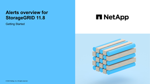

= Gerenciar alertas: Visão geral
:allow-uri-read: 
:icons: font
:imagesdir: ../media/

[role="lead"]
O sistema de alerta fornece uma interface fácil de usar para detetar, avaliar e resolver os problemas que podem ocorrer durante a operação do StorageGRID.

Você pode criar alertas personalizados, editar ou desativar alertas e gerenciar notificações de alerta.

Para saber mais:

* Reveja o vídeo: https://netapp.hosted.panopto.com/Panopto/Pages/Viewer.aspx?id=4506fc61-c8e9-4b86-ba00-b0b901184b38["Vídeo: Visão geral dos alertas para o StorageGRID 11,8"^]
+
[link=https://netapp.hosted.panopto.com/Panopto/Pages/Viewer.aspx?id=4506fc61-c8e9-4b86-ba00-b0b901184b38]

* Reveja o vídeo: https://netapp.hosted.panopto.com/Panopto/Pages/Viewer.aspx?id=e3a75bc1-47a2-44b9-a84d-b0b9011dc2d1["Vídeo: Usando métricas para criar alertas personalizados no StorageGRID 11,8"^]
+
[link=https://netapp.hosted.panopto.com/Panopto/Pages/Viewer.aspx?id=e3a75bc1-47a2-44b9-a84d-b0b9011dc2d1]
image::../media/video-screenshot-alert-create-custom-118.png[Vídeo: Usando métricas para criar alertas personalizados no StorageGRID 11,8]

* Consulte link:alerts-reference.html["Referência de alertas"].

