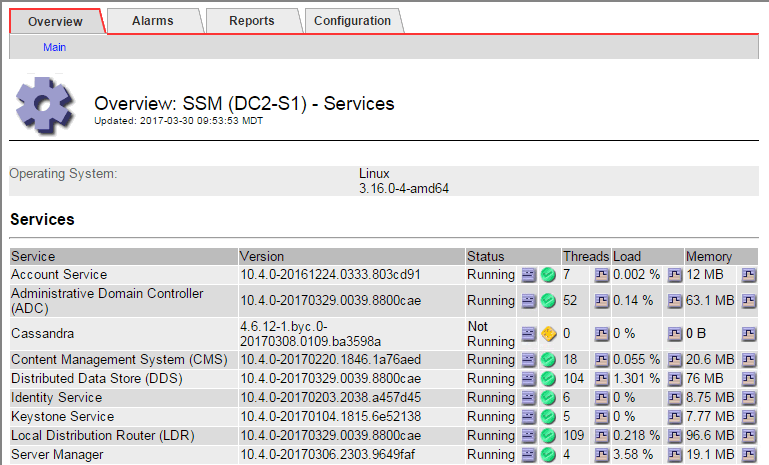

= Solucionar problemas de metadados
:allow-uri-read: 
:icons: font
:imagesdir: ../media/

[role="lead"]
Você pode executar várias tarefas para ajudar a determinar a origem dos problemas de metadados.

== Alerta baixo de armazenamento de metadados

Se o alerta *armazenamento de metadados baixo* for acionado, você deverá adicionar novos nós de armazenamento.

.Antes de começar
* Você está conetado ao Gerenciador de Grade usando um link:../admin/web-browser-requirements.html["navegador da web suportado"].

.Sobre esta tarefa
O StorageGRID reserva uma certa quantidade de espaço no volume 0 de cada nó de storage para metadados de objetos. Esse espaço é conhecido como espaço reservado real, e é subdividido no espaço permitido para metadados de objetos (o espaço permitido de metadados) e o espaço necessário para operações essenciais de banco de dados, como compactação e reparo. O espaço de metadados permitido rege a capacidade geral do objeto.

image::../media/metadata_allowed_space_volume_0.png[Metadados volume de espaço permitido 0]

Se os metadados de objetos consumirem mais de 100% do espaço permitido para metadados, as operações do banco de dados não poderão ser executadas de forma eficiente e ocorrerão erros.

Você pode link:../monitor/monitoring-storage-capacity.html#monitor-object-metadata-capacity-for-each-storage-node["Monitore a capacidade dos metadados de objetos para cada nó de storage"]ajudá-lo a antecipar erros e corrigi-los antes que eles ocorram.

O StorageGRID usa a seguinte métrica Prometheus para medir o quão cheio é o espaço permitido de metadados:

[listing]
----
storagegrid_storage_utilization_metadata_bytes/storagegrid_storage_utilization_metadata_allowed_bytes
----
Quando essa expressão Prometheus atinge certos limites, o alerta *armazenamento de metadados baixo* é acionado.

* *Minor*: Metadados de objetos estão usando 70% ou mais do espaço de metadados permitido. Você deve adicionar novos nós de storage o mais rápido possível.
* *Major*: Metadados de objetos estão usando 90% ou mais do espaço permitido de metadados. Você deve adicionar novos nós de storage imediatamente.
+

CAUTION: Quando os metadados de objetos estão usando 90% ou mais do espaço permitido de metadados, um aviso aparece no painel. Se esse aviso for exibido, você deverá adicionar novos nós de storage imediatamente. Você nunca deve permitir que os metadados de objetos usem mais de 100% do espaço permitido.

* *Crítico*: Metadados de objetos estão usando 100% ou mais do espaço permitido de metadados e estão começando a consumir o espaço necessário para operações essenciais de banco de dados. Você deve interromper a ingestão de novos objetos e adicionar novos nós de storage imediatamente.

No exemplo a seguir, metadados de objetos estão usando mais de 100% do espaço permitido de metadados. Esta é uma situação crítica, o que resultará em erros e operações ineficientes do banco de dados.

image::../media/cdlp_dashboard_alarm.gif[Alarme do painel de metadados]

CAUTION: Se o tamanho do volume 0 for menor do que a opção de armazenamento de espaço reservado de metadados (por exemplo, em um ambiente não-produção), o cálculo do alerta *armazenamento de metadados baixo* pode ser impreciso.

.Passos
. Selecione *ALERTAS* > *atual*.
. Na tabela de alertas, expanda o grupo de alertas *armazenamento de metadados baixo*, se necessário, e selecione o alerta específico que deseja exibir.
. Reveja os detalhes na caixa de diálogo de alerta.
. Se um alerta importante ou crítico de *armazenamento de metadados baixo* tiver sido acionado, execute uma expansão para adicionar nós de armazenamento imediatamente.
+

NOTE: Como o StorageGRID mantém cópias completas de todos os metadados de objetos em cada local, a capacidade de metadados de toda a grade é limitada pela capacidade de metadados do menor local. Se você precisar adicionar capacidade de metadados a um local, também deverá link:../expand/adding-grid-nodes-to-existing-site-or-adding-new-site.html["expanda quaisquer outros sites"]pelo mesmo número de nós de storage.

+
Após a expansão, o StorageGRID redistribui os metadados de objetos existentes para os novos nós, o que aumenta a capacidade geral de metadados da grade. Nenhuma ação do usuário é necessária. O alerta *armazenamento de metadados baixo* é apagado.

== Serviços: Status - alarme Cassandra (SVST)

O alarme Serviços: Status - Cassandra (SVST) indica que você pode precisar reconstruir o banco de dados Cassandra para um nó de armazenamento. O Cassandra é usado como o armazenamento de metadados do StorageGRID.

.Antes de começar
* Você deve estar conetado ao Gerenciador de Grade usando um link:../admin/web-browser-requirements.html["navegador da web suportado"].
* Você link:../admin/admin-group-permissions.html["permissões de acesso específicas"]tem .
* Tem de ter o `Passwords.txt` ficheiro.

.Sobre esta tarefa
Se o Cassandra for interrompido por mais de 15 dias (por exemplo, o nó de armazenamento está desligado), o Cassandra não será iniciado quando o nó for colocado novamente on-line. Você deve reconstruir o banco de dados Cassandra para o serviço DDS afetado.

Você pode link:../monitor/running-diagnostics.html["execute o diagnóstico"]obter informações adicionais sobre o estado atual da sua grade.

CAUTION: Se dois ou mais serviços de banco de dados do Cassandra estiverem inativos por mais de 15 dias, entre em Contato com o suporte técnico e não prossiga com as etapas abaixo.

.Passos
. Selecione *SUPPORT* > *Tools* > *Grid topology*.
. Selecione *_Site_* > *_Storage Node_* > *SSM* > *Serviços* > *Alarmes* > *Principal* para exibir alarmes.
+
Este exemplo mostra que o alarme SVST foi acionado.

+
image::../media/svst_alarm.gif[Alarmes: SSM: Página de serviços]

+
A página principal dos Serviços de SSM também indica que o Cassandra não está em execução.

+

. [[Restart_Cassandra_from_the_Storage_Node]]Tente reiniciar o Cassandra a partir do nó de armazenamento:
+
.. Faça login no nó da grade:
+
... Introduza o seguinte comando: `ssh admin@grid_node_IP`
... Introduza a palavra-passe listada no `Passwords.txt` ficheiro.
... Digite o seguinte comando para mudar para root: `su -`
... Introduza a palavra-passe listada no `Passwords.txt` ficheiro. Quando você estiver conetado como root, o prompt mudará de `$` para `#`.

.. Introduza: `/etc/init.d/cassandra status`
.. Se o Cassandra não estiver em execução, reinicie-o: `/etc/init.d/cassandra restart`

. Se o Cassandra não reiniciar, determine quanto tempo o Cassandra esteve inativo. Se o Cassandra estiver inativo por mais de 15 dias, você deverá reconstruir o banco de dados do Cassandra.
+

CAUTION: Se dois ou mais serviços de banco de dados do Cassandra estiverem inoperantes, entre em Contato com o suporte técnico e não prossiga com as etapas abaixo.

+
Você pode determinar por quanto tempo o Cassandra ficou para baixo, traçando-o ou revisando o arquivo servermanager.log.

. Para traçar o gráfico Cassandra:
+
.. Selecione *SUPPORT* > *Tools* > *Grid topology*. Em seguida, selecione *_Site_* > *_Storage Node_* > *SSM* > *Serviços* > *relatórios* > *gráficos*.
.. Selecione *Atributo* > *Serviço: Status - Cassandra*.
.. Para *Data de Início*, insira uma data que seja pelo menos 16 dias antes da data atual. Para *Data de fim*, insira a data atual.
.. Clique em *Atualizar*.
.. Se o gráfico mostrar que o Cassandra está inativo por mais de 15 dias, reconstrua o banco de dados do Cassandra.
+
O exemplo de gráfico a seguir mostra que o Cassandra esteve inativo por pelo menos 17 dias.

+
image::../media/cassandra_not_running_chart.png[Visão geral: SSM: Página de serviços]

. Para analisar o arquivo servermanager.log no nó de storage:
+
.. Faça login no nó da grade:
+
... Introduza o seguinte comando: `ssh admin@grid_node_IP`
... Introduza a palavra-passe listada no `Passwords.txt` ficheiro.
... Digite o seguinte comando para mudar para root: `su -`
... Introduza a palavra-passe listada no `Passwords.txt` ficheiro. Quando você estiver conetado como root, o prompt mudará de `$` para `#`.

.. Introduza: `cat /var/local/log/servermanager.log`
+
O conteúdo do arquivo servermanager.log é exibido.

+
Se o Cassandra estiver inativo por mais de 15 dias, a seguinte mensagem é exibida no arquivo servermanager.log:

+
[listing]
----
"2014-08-14 21:01:35 +0000 | cassandra | cassandra not
started because it has been offline for longer than
its 15 day grace period - rebuild cassandra
----
.. Certifique-se de que o carimbo de data/hora desta mensagem é o momento em que você tentou reiniciar o Cassandra conforme instruído na etapa <<restart_Cassandra_from_the_Storage_Node,Reinicie o Cassandra a partir do nó de storage>>.
+
Pode haver mais de uma entrada para Cassandra; você deve localizar a entrada mais recente.

.. Se o Cassandra estiver inativo por mais de 15 dias, você deverá reconstruir o banco de dados do Cassandra.
+
Para obter instruções, link:../maintain/recovering-storage-node-that-has-been-down-more-than-15-days.html["Recupere o nó de storage abaixo mais de 15 dias"]consulte .

.. Entre em Contato com o suporte técnico se os alarmes não forem claros depois que o Cassandra for reconstruído.

== Erros de memória sem Cassandra (alarme SMTT)

Um alarme de Eventos totais (SMTT) é acionado quando o banco de dados Cassandra tem um erro de memória fora. Se este erro ocorrer, contacte o suporte técnico para resolver o problema.

.Sobre esta tarefa
Se ocorrer um erro de falta de memória para o banco de dados do Cassandra, um despejo de heap é criado, um alarme de Eventos totais (SMTT) é acionado e a contagem de erros de memória do Cassandra é incrementada por um.

.Passos
. Para visualizar o evento, selecione *support* > *Tools* > *Grid topology* > *Configuration*.
. Verifique se a contagem de erros de memória do Cassandra Heap é 1 ou superior.
+
Você pode link:../monitor/running-diagnostics.html["execute o diagnóstico"]obter informações adicionais sobre o estado atual da sua grade.

. Vá para `/var/local/core/`, compacte o `Cassandra.hprof` arquivo e envie-o para o suporte técnico.
. Faça um backup do `Cassandra.hprof` arquivo e exclua-o do `/var/local/core/ directory`.
+
Este arquivo pode ter até 24 GB, então você deve removê-lo para liberar espaço.

. Depois que o problema for resolvido, marque a caixa de seleção *Redefinir* para a contagem de erros de memória de saída do Cassandra. Em seguida, selecione *aplicar alterações*.
+

NOTE: Para redefinir contagens de eventos, você deve ter a permissão de configuração de página de topologia de Grade.

